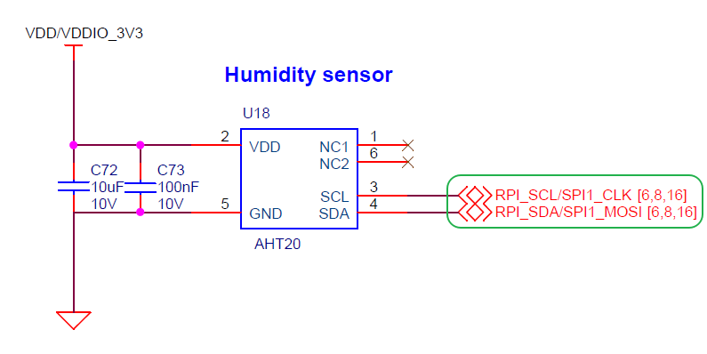

# Edgi-Talk_M33_AHT20 示例工程

**中文** | [**English**](./README.md)

## 简介

本示例工程基于 **Edgi-Talk平台**，演示 **AHT20 温湿度传感器** 的驱动和使用方法。
通过本工程，用户可以快速体验 AHT20 的数据采集与处理，并在开发板上通过串口查看采样结果。

### AHT10 软件包简介
AHT10 软件包提供了使用温度与湿度传感器 aht10 基本功能，并且提供了软件平均数滤波器可选功能，如需详细了解该软件包，请参考 AHT10 软件包中的 README。

## 硬件说明
### 传感器连接接口

### 电平转换

### BTB座子

### MCU引脚

### 实物图位置

## 软件说明

* 工程基于 **Edgi-Talk** 平台开发。
* 示例功能包括：

  * AHT20 初始化与通信（I²C）
  * 温湿度数据读取与解析
  * 串口打印采样数据
* 工程结构清晰，便于用户理解 I²C 驱动与传感器接口。

## 使用方法

### 编译与下载

1. 打开工程并完成编译。
2. 使用 **板载下载器 (DAP)** 将开发板的 USB 接口连接至 PC。
3. 通过编程工具将生成的固件烧录至开发板。

### 运行效果

* 烧录完成后，开发板上电即可运行示例工程。
* 系统会初始化 AHT20 并开始采样温湿度数据。
* 采样结果通过串口打印，示例输出如下：

```
 \ | /
- RT -     Thread Operating System
 / | \     5.0.2 build Sep  5 2025 14:13:02
 2006 - 2022 Copyright by RT-Thread team
Hello RT-Thread
This core is cortex-m33
msh >[I/aht10] AHT10 has been initialized!
[D/aht10] Humidity   : 44.4 %
[D/aht10] Temperature: 29.7
[D/aht10] Humidity   : 44.4 %
[D/aht10] Temperature: 29.7
```
## 注意事项

* 如需修改工程的 **图形化配置**，请使用以下工具打开配置文件：

```
tools/device-configurator/device-configurator.exe
libs/TARGET_APP_KIT_PSE84_EVAL_EPC2/config/design.modus
```

* 修改完成后保存配置，并重新生成代码。

## 启动流程

系统启动顺序如下：

```
+------------------+
|   Secure M33     |
|   (安全内核启动)  |
+------------------+
          |
          v
+------------------+
|       M33        |
|   (非安全核启动)  |
+------------------+
          |
          v
+-------------------+
|       M55         |
|  (应用处理器启动)  |
+-------------------+
```

⚠️ 请严格按照以上顺序烧写固件，否则系统可能无法正常运行。

---

* 若示例工程无法正常运行，建议先编译并烧录 **Edgi-Talk\_M33\_S\_Template** 工程，确保初始化与核心启动流程正常，再运行本示例。
* 若要开启 M55，需要在 **M33 工程** 中打开配置：

  ```
  RT-Thread Settings --> 硬件 --> select SOC Multi Core Mode --> Enable CM55 Core
  ```

