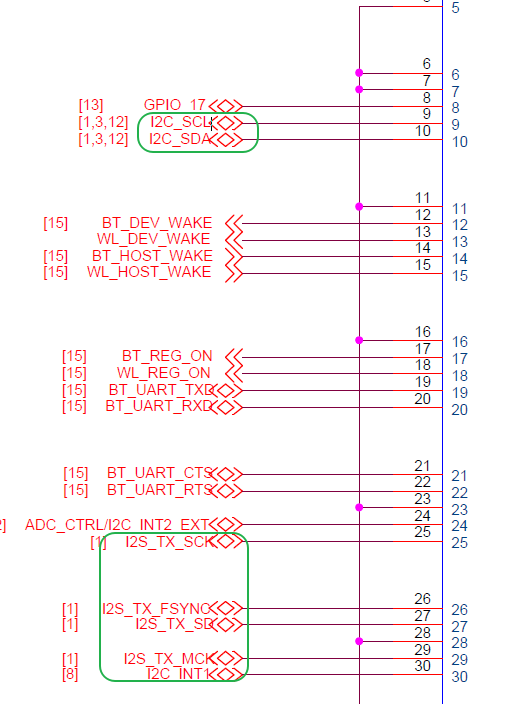

# Edgi-Talk_Audio 示例工程

**中文** | [**English**](./README.md)

## 简介

本示例工程基于 **Edgi-Talk平台**，演示 **音频录制与播放** 功能，运行在 **RT-Thread 实时操作系统** 上。
通过本工程，用户可以体验麦克风采集音频数据并通过扬声器播放，同时通过按钮控制播放/停止状态，并通过 LED 指示当前播放状态。
### Audio 简介
Audio （音频）设备是嵌入式系统中非常重要的一个组成部分，负责音频数据的采样和输出。Audio  设备通常由数据总线接口、控制总线接口、音频编解码器（Codec）、扬声器和麦克风等组成，如下图所示：


#### Audio 设备特性
RT-Thread Audio 设备驱动框架是 Audio 框架的底层部分，主要负责原生音频数据的采集和输出、音频流的控制、音频设备的管理、音量调节以及不同硬件和 Codec 的抽象等。
- 接口：标准 device 接口(open/close/read/control)。
- 同步模式访问。
- 支持播放和录音。
- 支持音频参数管理。
- 支持音量调节。

## 硬件说明
### ES8388连接接口

### 喇叭接口

### 控制引脚

### BTB座子

### MCU接口

### 实物图位置


## 软件说明

* 工程基于 **Edgi-Talk M33** 平台开发。
* 示例功能包括：

  * 麦克风音频采集
  * 音频数据播放到扬声器
  * 按钮控制音频播放/停止
  * LED 指示播放状态
* 工程结构清晰，便于理解 RT-Thread 音频设备驱动和事件处理机制。

## 使用方法

### 编译与下载

1. 打开工程并完成编译。
2. 使用 **板载下载器 (DAP)** 将开发板的 USB 接口连接至 PC。
3. 通过编程工具将生成的固件烧录至开发板。

   * 工程可自动调用签名工具（如 `tools/edgeprotecttools/bin/edgeprotecttools.exe`）合并烧录固件（如 `proj_cm33_s_signed.hex`）。

### 运行效果

* 烧录完成后，开发板上电即可运行示例工程。
* LED 灯默认点亮表示音频播放已启用。
* 按下按钮可 **切换音频播放状态**：

  * **播放**：LED 点亮，麦克风采集的音频播放到扬声器
  * **停止**：LED 熄灭，音频播放暂停
* 系统可连续采集和播放音频数据，实现实时音频回放。

## 注意事项

* 如需修改工程的 **图形化配置**，请使用以下工具打开配置文件：

  ```
  tools/device-configurator/device-configurator.exe
  libs/TARGET_APP_KIT_PSE84_EVAL_EPC2/config/design.modus
  ```
* 修改完成后保存配置，并重新生成代码。

## 启动流程

系统启动顺序如下：

```
+------------------+
|   Secure M33     |
|   (安全内核启动)  |
+------------------+
          |
          v
+------------------+
|       M33        |
|   (非安全核启动)  |
+------------------+
          |
          v
+-------------------+
|       M55         |
|  (应用处理器启动)  |
+-------------------+
```

⚠️ 请严格按照以上顺序烧写固件，否则系统可能无法正常运行。

---

* 若示例工程无法正常运行，建议先编译并烧录 **Edgi-Talk\_M33\_S\_Template** 工程，确保初始化与核心启动流程正常，再运行本示例。
* 若要开启 M55，需要在 **M33 工程** 中打开配置：

  ```
  RT-Thread Settings --> 硬件 --> select SOC Multi Core Mode --> Enable CM55 Core
  ```

