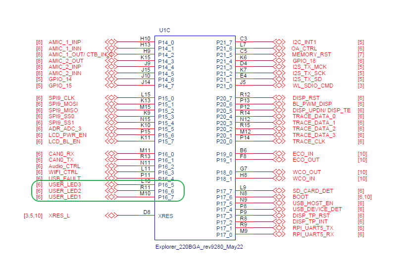

# Edgi-Talk_M33_Blink_LED Example Project

[**中文**](./README_zh.md) | **English**

## Introduction

This example project is based on the **Edgi-Talk platform** and demonstrates the **blue LED blinking** function running on the **RT-Thread real-time operating system**.
Through this project, users can quickly verify the board-level GPIO configuration and LED control logic, providing a fundamental reference for future hardware control and application development.

## GPIO Overview

**GPIO (General Purpose Input/Output)** is one of the most commonly used peripheral interfaces in MCUs.
It can be configured in software as either **input mode** or **output mode**:

* **Input mode**: Used to read external voltage levels, such as button input.
* **Output mode**: Used to control peripheral signals, such as lighting an LED or driving a buzzer.

### RT-Thread GPIO Abstraction

RT-Thread provides a **PIN device driver framework**, which abstracts hardware differences through a unified API interface:

* `rt_pin_mode(pin, mode)`: Set the pin mode (input/output/pull-up/pull-down, etc.)
* `rt_pin_write(pin, value)`: Output a voltage level (high/low)
* `rt_pin_read(pin)`: Read the input voltage level

This allows developers to perform GPIO control without directly manipulating registers, using RT-Thread’s API instead.

In this example, the LED pin is configured as **output mode**, and software toggles the output level in a loop to make the LED blink.

## Software Description

* The project is developed based on the **Edgi-Talk** platform.

* Example functionalities include:

  * Blue LED blinking periodically
  * GPIO output control

* The project structure is simple and easy to understand, helping users grasp LED control logic and hardware driver interfaces.

## Hardware Description




As shown above, the Edgi-Talk board provides three user LEDs: USER_LED1 (RED), USER_LED2 (GREEN), and USER_LED3 (BLUE).
USER_LED2 corresponds to pin **P16_6**.
When the MCU outputs a **high level**, the LED turns **on**; when the MCU outputs a **low level**, the LED turns **off**.

The LED location on the board is shown below:


## Usage Instructions

### Compilation and Download

1. Open the project and complete the compilation.
2. Connect the board’s USB port to the PC using the **onboard debugger (DAP)**.
3. Use the programming tool to flash the generated firmware to the development board.

### Runtime Behavior

* After flashing, power on the board to run the example project.
* The **blue LED blinks every 500 ms**, indicating normal GPIO operation and system scheduling.
* Users can modify the blinking interval or LED control logic as needed.

## Notes

* To modify the **graphical configuration** of the project, open the configuration file using the following tool:

```
tools/device-configurator/device-configurator.exe
libs/TARGET_APP_KIT_PSE84_EVAL_EPC2/config/design.modus
```

* After modification, save the configuration and regenerate the code.

## Boot Sequence

The system boot sequence is as follows:

```
+------------------+
|   Secure M33     |
|   (Secure Core)  |
+------------------+
          |
          v
+------------------+
|       M33        |
| (Non-Secure Core)|
+------------------+
          |
          v
+-------------------+
|       M55         |
| (Application Core)|
+-------------------+
```

⚠️ Please strictly follow the boot sequence above when flashing firmware; otherwise, the system may not run properly.

---

* If the example project does not run correctly, compile and flash the **Edgi-Talk_M33_S_Template** project first to ensure proper initialization and core startup before running this example.
* To enable the M55 core, configure the **M33 project** as follows:

  ```
  RT-Thread Settings --> Hardware --> select SOC Multi Core Mode --> Enable CM55 Core
  ```
