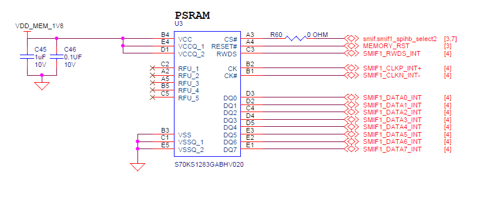

# Edgi-Talk_M33_S_HyperRam Example Project

[**中文**](./README_zh.md) | **English**

## Introduction

This example project is based on a **Bare Metal** architecture, mainly demonstrating and configuring **Secure M33 HyperRam** features.
Additionally, this project can serve as a foundational template for secondary development or project creation, helping users quickly get started and extend functionality.

## HyperRAM Overview

### 1. General Description

**HyperRAM** is a **high-performance, low-pin-count (LPC) DRAM** initially introduced by **Cypress (now Infineon)**.

It uses the **HyperBus interface**, primarily targeting applications requiring **high bandwidth, low power, and simple interfaces**, such as **embedded systems, display control, IoT devices, and automotive electronics**.

HyperRAM is classified as **pSRAM (Pseudo-SRAM)**: externally it behaves like SRAM (simple read/write without user refresh), but internally it is low-power DRAM (self-refresh).

### 2. Architecture and Interface

HyperRAM uses the **HyperBus interface**, characterized by:

* **Few pins**: typically only **13 signal pins** (8-bit data bus + control/clock), greatly reducing PCB complexity compared to traditional SDRAM (dozens of pins).
* **Double Data Rate (DDR) transfer**: data is transmitted on both rising and falling clock edges to increase bandwidth.
* **Serial control protocol**: accesses memory using command-address-data sequences, simplifying design.

Interface structure:

* **Data lines DQ[7:0]**: 8-bit bidirectional data
* **RWDS (Read-Write Data Strobe)**: data synchronization signal
* **CLK**: clock input
* **CS#**: chip select
* **RESET#**: reset
* **CKE**: clock enable

### 3. Working Principle

HyperRAM is accessed via **command + address + data**:

1. **Command Phase**

   * The host sends a read/write command and target address.
2. **Latency Phase**

   * HyperRAM prepares its internal memory array (configurable latency).
3. **Data Transfer Phase**

   * Data is transferred on **DQ[7:0]** in DDR mode, with RWDS providing data synchronization.

Internally it uses DRAM technology with **self-refresh**, but externally it behaves like SRAM — users do not need to manage refresh operations.

### 4. Performance Features

* **Data bus width**: 8-bit
* **Operating voltage**: 1.8 V or 3.0 V (low-power design)
* **Data rate**: up to **400 MB/s (200 MHz DDR × 8-bit)**
* **Capacity range**: 32 Mb ~ 512 Mb (4 MB ~ 64 MB)
* **Low power**: supports deep sleep mode, standby current < 10 µA
* **Simple interface**: high-speed access using only 13 pins

### 5. Advantages of HyperRAM

1. **Low pin count**

   * Significantly reduces pin requirements compared to traditional SDRAM/PSRAM (30+ pins), saving PCB routing.
2. **High bandwidth**

   * DDR interface, bandwidth up to 400 MB/s, suitable for **image buffering and display refresh**.
3. **Low power consumption**

   * Ideal for battery-powered devices such as IoT and wearable devices.
4. **Ease of use**

   * Behaves like SRAM externally, simple and user-friendly, no manual refresh needed.

### 6. Comparison with Other Memories

| Feature      | HyperRAM           | SDRAM / DDR        | SRAM                     | NOR Flash       |
| ------------ | ------------------ | ------------------ | ------------------------ | --------------- |
| Interface    | HyperBus (13-pin)  | Parallel 16~32-bit | Parallel/Serial          | SPI/QSPI        |
| Capacity     | 32Mb ~ 512Mb       | 64Mb ~ 1Gb+        | Small (Kb~Mb)            | 4Mb ~ 2Gb       |
| Bandwidth    | ~400 MB/s          | ~800 MB/s+         | ~50 MB/s                 | ~100 MB/s       |
| Power        | Low                | High               | Low                      | Low             |
| Applications | Cache/Frame Buffer | System Memory      | High-speed small storage | Program Storage |

## Hardware Description

### HyperRam Interface



## Software Description

* The project is developed based on the **Edgi-Talk** platform.

* The example covers:

  * **Secure region configuration**
  * **Basic startup process demonstration**

* The project code structure is simple and clear, making it easy to understand and port.

## Usage

### Build and Download

1. Open the project and compile it.
2. Connect the board’s USB interface to the PC using the **onboard debugger (DAP)**.
3. Use the programming tool to flash the compiled firmware to the board.

### Running Result

* After flashing, power on the board to run the example.
* The system will start successfully and jump to the **M33 core**, indicating that the secure configuration is effective.

## Notes

* To modify the **graphical configuration**, open the configuration file using the following tool:

```
tools/device-configurator/device-configurator.exe
libs/TARGET_APP_KIT_PSE84_EVAL_EPC2/config/design.modus
```

* After modification, save the configuration and regenerate the code.

## Startup Sequence

The system starts in the following order:

```
+------------------+
|   Secure M33     |
|  (Secure Core)   |
+------------------+
          |
          v
+------------------+
|       M33        |
| (Non-Secure Core)|
+------------------+
          |
          v
+-------------------+
|       M55         |
| (Application Core)|
+-------------------+
```

⚠️ Please strictly follow the above flashing sequence; otherwise, the system may fail to run properly.
