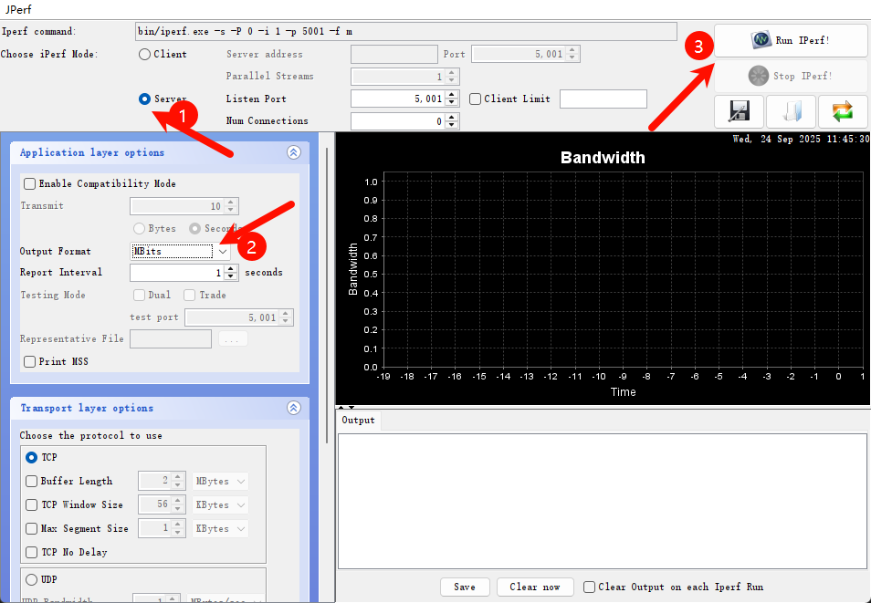

# Edgi-Talk_WIFI Example Project

## Introduction

This example project is based on the **Edgi-Talk platform** and demonstrates **WIFI functionality**, running on the **RT-Thread real-time operating system (M55 core)**.
It allows users to quickly experience WIFI connectivity and verify the WIFI module interface, providing a reference for future WIFI development.

## Software Description

* Developed on the **Edgi-Talk** platform.

* Example features include:

  * WIFI scanning
  * WIFI connection
  * Iperf performance testing

* The project structure is clear, making it easy to understand the integration between the WIFI driver and the RT-Thread system.

## Usage

### Build and Flash

1. Open the project and complete the build.
2. Connect the board’s **USB interface** to the PC using the **onboard DAP debugger**.
3. Use a programming tool to flash the compiled firmware to the development board.

### Running the Demo

* After flashing, power on the board to run the example.
* The system will automatically initialize the WIFI device.
* Users can connect to WIFI via the **serial terminal** using the command:

```
wifi join <SSID> <Password>
```

* Once connected, use `iperf` to test network performance.
* The `jperf.rar` tool is provided in `packages\netutils-latest\tools`.
* Extract it and double-click the `.bat` file to launch the tool. The interface is shown below:



* On the board terminal, run the following command (replace `<PC_IP>` with the actual PC IP) to start testing:

```
iperf -c <PC_IP>
```

### Notes

* You can use a PC hotspot for testing; 2.4 GHz is recommended.

## Boot Process

The system boot sequence is as follows:

```
+------------------+
|   Secure M33     |
| (Secure Core)    |
+------------------+
          |
          v
+------------------+
|       M33        |
| (Non-secure Core)|
+------------------+
          |
          v
+-------------------+
|       M55         |
| (Application Core)|
+-------------------+
```

⚠️ Please strictly follow the above flashing sequence; otherwise, the system may not operate properly.

---

* If the example project does not run correctly, it is recommended to first build and flash the **Edgi-Talk_M33_S_Template** and **Edgi-Talk_M33_Template** projects to ensure proper initialization and core boot sequence before running this demo.
* To enable the M55 core, open the configuration in the **Edgi-Talk_M33_Template** project:

```
RT-Thread Settings --> Hardware --> select SOC Multi Core Mode --> Enable CM55 Core
```
