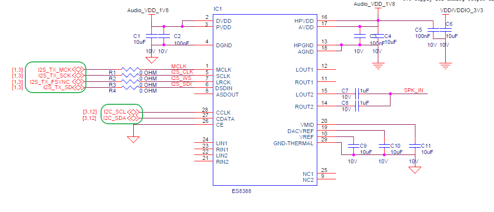
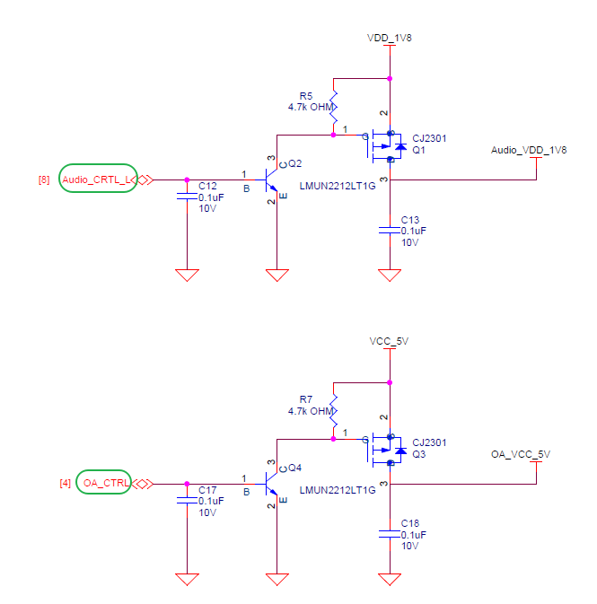
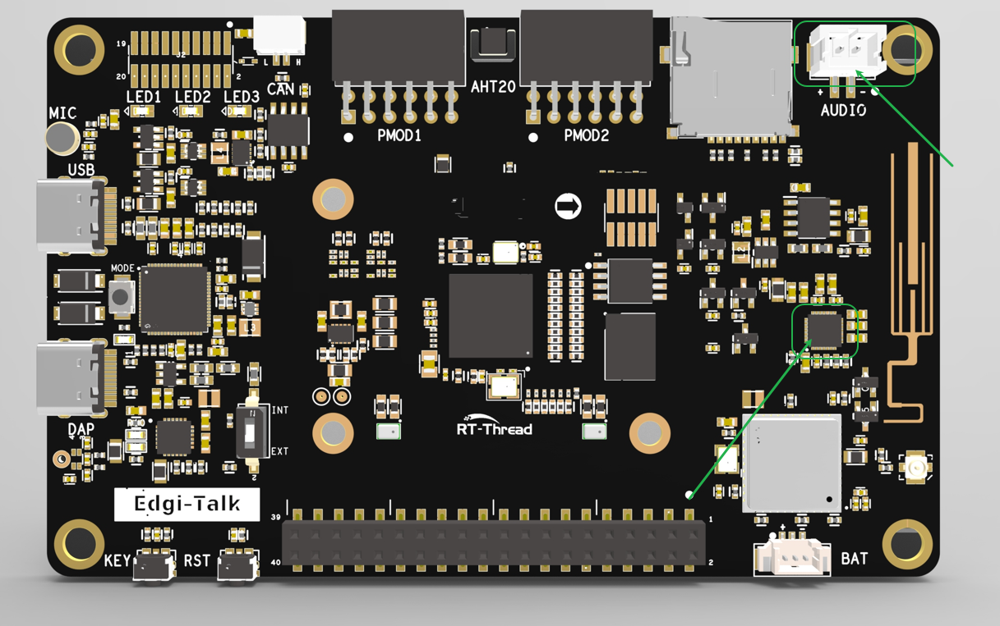

# Edgi-Talk_WavPlayer 示例工程

**中文** | [**English**](./README.md)

## 简介

本示例工程基于 **Edgi-Talk 平台**，演示 **WAV 音频播放功能**，运行在 **RT-Thread 实时操作系统 (M33 核)** 上。
通过本工程，用户可以快速体验 WAV 音频文件的播放机制，并验证音频解码和驱动接口，为后续音频应用开发提供参考。

## 硬件说明
### ES8388连接接口

### 喇叭接口

### 控制引脚

### BTB座子

### MCU接口

### 实物图位置


## 软件说明

* 工程基于 **Edgi-Talk** 平台开发。

* 示例功能包括：

  * WAV 文件解析与播放
  * 音频数据通过板载 DAC 或音频外设输出
  * 支持 PCM16 格式 WAV 文件
  * 支持 **16 kHz、24 kHz、48 kHz** 采样率
  * 支持 **双声道** 输出
  * 串口打印播放状态信息

* 工程结构清晰，便于理解音频播放驱动和 RT-Thread 文件系统的配合使用。

## 使用方法

### 编译与下载

1. 打开工程并完成编译。
2. 使用 **板载下载器 (DAP)** 将开发板的 USB 接口连接至 PC。
3. 通过编程工具将生成的固件烧录至开发板。
4. 将 WAV 音频文件拷贝至 SD 卡或外部存储设备的根目录，例如 `16000.wav`。

### 运行效果

* 烧录完成后，开发板上电即可运行示例工程。
* 系统会自动初始化 I2C、I2S 音频设备，并挂载存储设备。
* 用户可在 **串口终端**使用以下命令启动播放：

```
wavplay -s 16000.wav
```

* 串口输出示例：

```
 \ | /
- RT -     Thread Operating System
 / | \     5.0.2 build Sep  8 2025 11:21:16
 2006 - 2022 Copyright by RT-Thread team
[I/I2C] I2C bus [i2c0] registered
[I/i2s] ES8388 init success.
[I/drv.mic] audio pdm registered.
[I/drv.mic] !!!Note: pdm depends on i2s0, they share clock.
found part[0], begin: 1048576, size: 29.739GB
Hello RT-Thread
This core is cortex-m33
msh />wavplay -s 16000.wav
[D/WAV_PLAYER] EVENT:PLAYSTOPPAUSERESUME, STATE:STOPPED -> PLAYING
[D/WAV_PLAYER] open wavplayer, device sound0
[D/WAV_PLAYER] Information:
[D/WAV_PLAYER] samplerate 16000
[D/WAV_PLAYER] channels 2
[D/WAV_PLAYER] sample bits width 16
[I/WAV_PLAYER] play start, uri=16000.wav
[I/i2s] Ready for I2S output
msh />
```

* 播放期间，串口将显示 WAV 文件采样率、声道数、位宽及播放状态信息。

### 注意事项

* WAV 文件需为 **PCM16 格式**，采样率可选择 **16 kHz、24 kHz 或 48 kHz**，输出为 **双声道**。
* 如需修改工程的 **图形化配置**，请使用以下工具打开配置文件：

```
tools/device-configurator/device-configurator.exe
libs/TARGET_APP_KIT_PSE84_EVAL_EPC2/config/design.modus
```

* 修改完成后保存配置，并重新生成代码。
* 请确保存储设备正确插入且挂载成功，否则无法播放音频文件。

## 启动流程

系统启动顺序如下：

```
+------------------+
|   Secure M33     |
|   (安全内核启动) |
+------------------+
          |
          v
+------------------+
|       M33        |
|   (非安全核启动) |
+------------------+
          |
          v
+-------------------+
|       M55         |
|  (应用处理器启动) |
+-------------------+
```

⚠️ 请严格按照以上顺序烧写固件，否则系统可能无法正常运行。

---

* 若示例工程无法正常运行，建议先编译并烧录 **Edgi-Talk\_M33\_S\_Template** 工程，确保初始化与核心启动流程正常，再运行本示例。
* 若要开启 M55，需要在 **M33 工程** 中打开配置：

```
RT-Thread Settings --> 硬件 --> select SOC Multi Core Mode --> Enable CM55 Core
```

