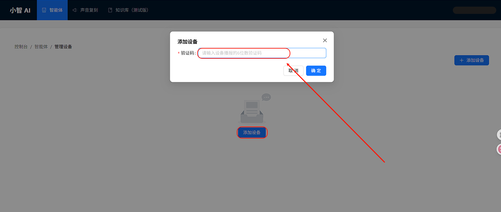
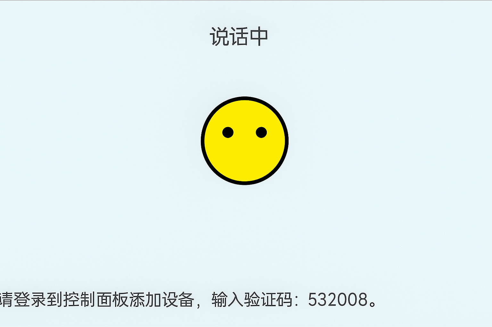

# XiaoZhi Example Project

## Introduction

This example demonstrates the **basic functionality of XiaoZhi voice interaction device** on the **Edgi-Talk platform**, running **RT-Thread RTOS**.
It allows users to quickly test Wi-Fi connection, key wake-up, and voice interaction, serving as a foundation for further application development.

## Software Description

* Developed on **Edgi-Talk** platform.
* Example features:

  * Wi-Fi connection and status display
  * Key wake-up and voice interaction
  * Device state management (standby, listening, sleep)

## Usage

### Build and Download

1. Open and compile the project.
2. Connect the board USB to PC via **DAP**.
3. Flash the compiled firmware to the device.

### Running Result

* After power-on, the device runs the example automatically.

* The screen displays the current status:

  * **Connecting** – connecting to Wi-Fi
  * **On standby** – idle mode
  * **Listening** – ready for voice interaction
  * **Sleeping** – low-power sleep mode

* Press the top button to enter **Listening** mode for voice interaction.

## Notes

* First-time setup requires backend binding via [XiaoZhi Official Website](https://xiaozhi.me/).
  
  

* Ensure Wi-Fi SSID and password are correct and use **2.4 GHz** frequency.

* Device must have internet access.

* To modify graphical configurations, use:

```
tools/device-configurator/device-configurator.exe
libs/TARGET_APP_KIT_PSE84_EVAL_EPC2/config/design.modus
```

* Save changes and regenerate code after modification.

## Startup Sequence

```
+------------------+
|   Secure M33     |
|  (Secure Core)   |
+------------------+
          |
          v
+------------------+
|       M33        |
| (Non-Secure Core)|
+------------------+
          |
          v
+-------------------+
|       M55         |
| (Application Core)|
+-------------------+
```

⚠️ Flash in this order strictly to ensure proper operation.

---

* If the example does not run, first compile and flash **Edgi-Talk_M33_S_Template**.
* To enable M55:

```
RT-Thread Settings --> Hardware --> select SOC Multi Core Mode --> Enable CM55 Core
```
