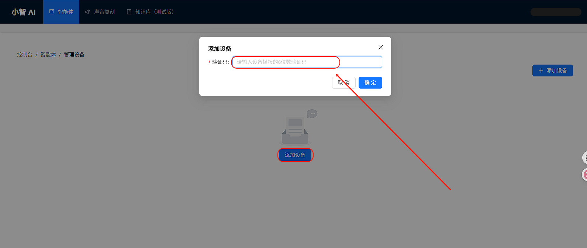

# 小智示例工程

## 简介

本示例工程基于 **Edgi-Talk 平台**，演示 **小智语音交互设备的基本功能**，运行在 **RT-Thread 实时操作系统** 上。
通过本工程，用户可以快速验证设备 **WiFi 连接**、**按键唤醒** 与 **语音交互** 功能，为后续应用开发提供基础参考。

## 软件说明

* 工程基于 **Edgi-Talk** 平台开发。
* 示例功能包括：

  * WiFi 连接与状态显示
  * 按键唤醒与语音交互
  * 设备状态管理（待机、监听、休眠等）

## 使用方法

### 编译与下载

1. 打开工程并完成编译。
2. 使用 **板载下载器 (DAP)** 将开发板的 USB 接口连接至 PC。
3. 通过编程工具将生成的固件烧录至设备。

### 运行效果

* 烧录完成后，设备上电即可运行示例工程。
* 屏幕会显示当前状态，包括：

  * **Connecting**：正在连接 WiFi
  * **On standby**：待机中
  * **Listening**：监听中，可与设备对话
  * **Sleeping**：休眠状态
* 按下顶部按键，可进入 **Listening** 状态进行语音交互。

## 注意事项
* 第一次需要进入 [小智官网](https://xiaozhi.me/) 进行后台绑定


* 请确保 WiFi 名称与密码正确，并使用 **2.4GHz 频段**。
* 设备需在可访问互联网的环境下使用。
* 如需修改工程的 **图形化配置**，请使用以下工具：

```
tools/device-configurator/device-configurator.exe
libs/TARGET_APP_KIT_PSE84_EVAL_EPC2/config/design.modus
```

* 修改完成后保存配置，并重新生成代码。

## 启动流程

系统启动顺序如下：

```
+------------------+
|   Secure M33     |
|   (安全内核启动)  |
+------------------+
          |
          v
+------------------+
|       M33        |
|   (非安全核启动)  |
+------------------+
          |
          v
+-------------------+
|       M55         |
|  (应用处理器启动)  |
+-------------------+
```

⚠️ 请严格按照以上顺序烧写固件，否则设备可能无法正常运行。

---

* 若示例工程无法正常运行，建议先编译并烧录 **Edgi-Talk_M33_S_Template** 工程，确保初始化与核心启动流程正常，再运行本示例。
* 若要开启 M55，需要在 **M33 工程** 中打开配置：

```
RT-Thread Settings --> 硬件 --> select SOC Multi Core Mode --> Enable CM55 Core
```

